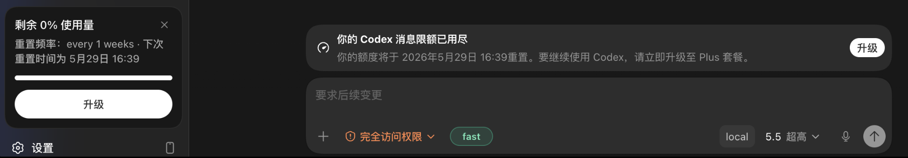

# codex-hide-usage-alert

一个给 [Codex++](https://github.com/BigPizzaV3/CodexPlusPlus) 使用的轻量用户脚本。

它会隐藏 Codex Desktop 里的额度提醒，适合 Codex++ mobile 远程同步 + API Key 混用的场景，让界面少一点打扰。

## 适用场景

当你用 Codex++ 做 mobile 远程同步，同时让模型调用走自己的 API Key 时，桌面端仍可能按原 ChatGPT 账号显示 Free/Plus 额度提醒。

这些提醒不一定代表当前模型调用真的被它限制，但会一直占着界面、打断使用体验。本脚本就是用来把这类提示藏起来。

## 会被隐藏的提醒

下图是问题出现时的两个提示。安装脚本后，图中的左侧用量卡和底部消息限额横幅会被隐藏。



## 功能范围

会隐藏：

- 底部的“Codex 消息限额已用尽”提醒横幅
- 左侧栏的“剩余 0% 使用量”卡片
- 英文界面中的新版 `You're out of Codex messages` 等额度提示弹窗/横幅

不会做：

- 不绕过额度限制
- 不修改账号状态
- 不修改请求内容
- 不影响 API Key 调用

它只让界面少显示这些提醒。

## 实现边界

- 运行位置：由 Codex++ 作为用户脚本注入到 Codex Desktop 的 renderer 页面。
- 保护边界：0.1.4 不会隐藏 composer、`form`、`contenteditable`、`textarea` 或 `input` 本身及包含它们的候选节点。
- 工作方式：启动时完整扫描一次；之后由 `MutationObserver` 只扫描新增或文字变化的局部 DOM，再用 CSS 隐藏匹配到的额度提醒节点。
- 生命周期：重复注入会先销毁旧实例；`scan()` 和 `destroy()` 可重复调用，不会累积 observer、样式或隐藏标记。
- 诊断入口：脚本会暴露 `window.__codexPlusHideUsageAlert`，可用于手动执行 `scan()` 或 `destroy()`。
- 作用范围：只影响前端显示层，不参与账号鉴权、请求发送、模型路由或 API Key 调用。

## 开发与验证

```bash
node test-matchers.js
node --check hide-usage-alert.js
```

## 开发文档

- `docs/superpowers/specs/2026-07-13-hide-usage-alert-design.md`：0.1.4 的 composer 防误伤、增量扫描、测试与发布设计。
- `docs/superpowers/plans/2026-07-13-hide-usage-alert-implementation.md`：0.1.4 的 TDD 实施、三处同步与实机验收步骤。

## 安装

下载 `hide-usage-alert.js`，放进 Codex++ 的用户脚本目录。目录位置取决于系统：

```text
macOS / Linux:
~/.config/Codex++/user_scripts/hide-usage-alert.js

Windows:
%APPDATA%\Codex++\user_scripts\hide-usage-alert.js
```

放好后，在 Codex++ 里重新加载用户脚本；如果左侧用量卡和底部消息限额横幅消失，就说明脚本已经生效。没有看到变化时，重启一次 Codex++ 和 Codex Desktop。

## 让 Agent 自动安装

也可以把下面这段发给本机 Agent，让它按当前系统自动选择目录：

```text
请帮我安装 codex-hide-usage-alert：

目标：安装 Codex++ 用户脚本，不要改 Codex Desktop 的安装文件。

1. 判断当前系统。
2. 找到 Codex++ 用户脚本目录：
   - macOS / Linux: ~/.config/Codex++/user_scripts
   - Windows: %APPDATA%\Codex++\user_scripts
3. 如果目录不存在，就创建它。
4. 下载脚本：
   https://raw.githubusercontent.com/Ghibli1024/codex-hide-usage-alert/main/hide-usage-alert.js
5. 保存为该目录下的 hide-usage-alert.js。
6. 确认文件已写入，并检查内容里包含 codexPlusHideUsageAlert。
7. 提醒我重新加载 Codex++ 用户脚本，并用左侧用量卡和底部消息限额横幅是否消失来判断是否生效。
8. 如果没有生效，再提醒我重启 Codex++ 和 Codex Desktop。
```

## 注意

这个文件需要交给 Codex++ 加载，不能当成浏览器油猴脚本或命令行脚本直接运行。

它不改 Codex Desktop 的程序文件，也不处理账号额度本身。后续如果 Codex Desktop 或 Codex++ 调整了界面，这个脚本可能需要同步更新。

## License

MIT License。你可以自由使用和修改；分发时请保留许可证文本。
